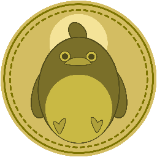

# Bottom Penguin Coin Website

A React-Tailwind website for Bottom Penguin Coin! The next coin that will go to the moon!

Live @ [coins.andrewli.site](https://coins.andrewli.site/)

Figma: https://www.figma.com/file/ZVgNmb42SzdBoZkflqJZvN/Bottom-Coin-Design?node-id=2%3A2

## Screenshot

\***Click the rocket 🚀 and go to the moon**

## Dependencies

- Tail Wind
- React
- SCSS
- three.js
- react-pdf

## License

